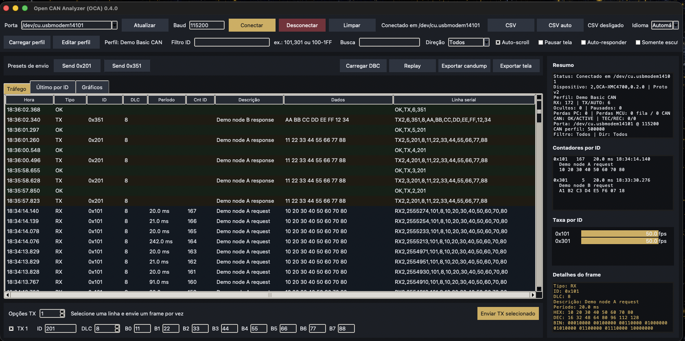
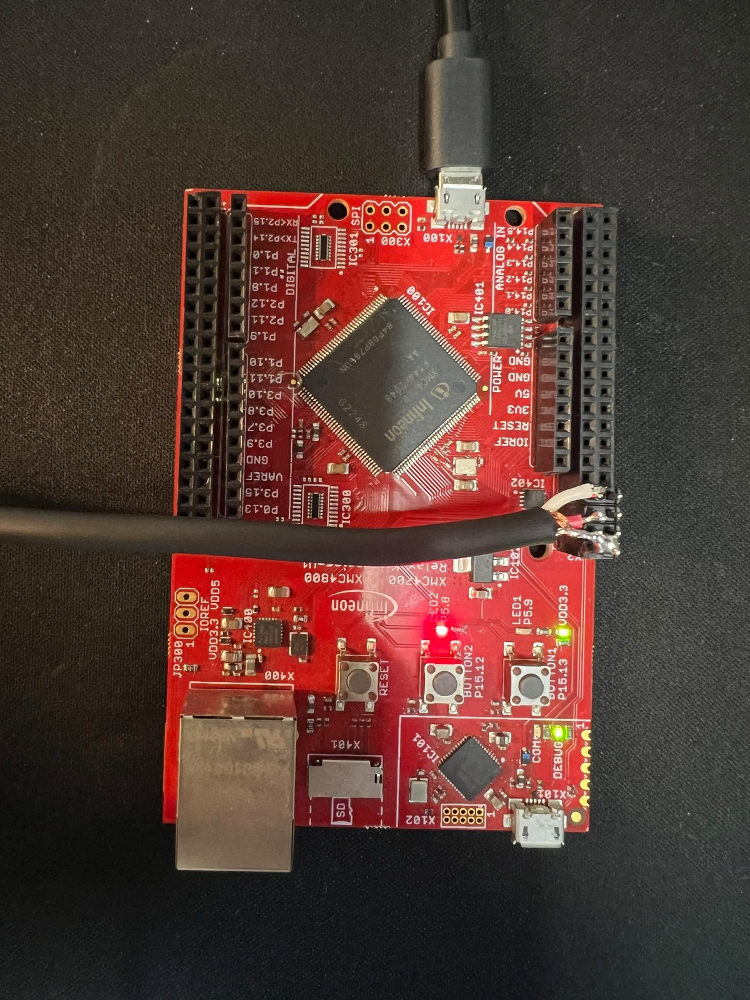

# Open CAN Analyzer (OCA)

[English](README.md)



Open CAN Analyzer é um projeto open source de aplicação desktop e firmware para receber,
inspecionar, transmitir, gravar, decodificar e reproduzir tráfego Classical CAN. A aplicação
Python/Tkinter funciona em Windows, Linux e macOS e se comunica por USB CDC com o firmware
XMC4700 incluído ou com outro adaptador compatível com o protocolo textual OCA.

OCA é uma ferramenta educacional e de desenvolvimento em bancada. Não é um produto de
diagnóstico certificado, uma autoridade para reparo veicular nem substituto direto de uma
suíte comercial de validação. Versão atual: **0.4.0**.

## Recursos

- Descoberta automática de portas, sem exigir um número fixo.
- Protocolo v1 e negociação v2 com timestamps e diagnóstico do controlador.
- CAN clássico padrão de 11 bits, DLC 0 a 8.
- Visões de tráfego, último frame por ID e gráfico temporal.
- Filtros de ID/faixa, direção e texto.
- Perfis JSON, presets TX e respostas automáticas opcionais.
- DBC opcional, decodificação e gráfico de sinais numéricos com `cantools`.
- Gravação CSV, replay, exportação da tela e formato candump.
- Controle de modo somente escuta quando o hardware protocolo v2 oferece suporte.
- Demonstração gráfica sintética que nunca transmite frames.
- Interface em inglês e português do Brasil.

## Hardware e protocolo

O repositório inclui um projeto DAVE 4 completo para a **KIT_XMC47_RELAX_V1** em
[`firmware/CAN_Analyzer_XMC4700_Relax`](firmware/CAN_Analyzer_XMC4700_Relax). O kit testado
usa um XMC4700 ARM Cortex-M4 com 2.048 kB de Flash e 352 kB de memória de dados. A placa também
possui depurador J-Link integrado, USB, transceiver CAN de alta velocidade IFX1051LE,
Ethernet, microSD e conectores de expansão. Consulte o
[manual oficial da Infineon](https://www.infineon.com/assets/row/public/documents/30/44/infineon-board-user-manual-xmc4700-xmc4800-relax-kit-series-usermanual-en.pdf)
e a [página oficial do kit](https://www.infineon.com/evaluation-board/KIT-XMC47-RELAX-V1).

<p align="center">
  
</p>

O firmware incluído está configurado para Classical CAN a 500 kbit/s, IDs padrão de 11 bits,
`CANH` em X2.33 e `CANL` em X2.35. O kit não possui terminação CAN de 120 ohms integrada;
instale a terminação externa adequada. Use uma referência comum quando a bancada exigir e
leia [docs/SAFETY.md](docs/SAFETY.md) antes de transmitir.

Também é possível usar outro adaptador CAN serial USB que implemente o protocolo ASCII de
[docs/PROTOCOL.md](docs/PROTOCOL.md). O hardware precisa oferecer USB CDC/porta serial virtual,
controlador e transceiver CAN, CANH/CANL, bitrate, terminação e proteção elétrica adequados.

O protocolo atual aceita apenas IDs padrão de 11 bits. Exemplo:

```text
RX2,1234,101,8,10,20,30,40,50,60,70,80
```

## Estrutura do repositório

```text
oca/                                      Pacote de protocolo e suporte desktop
can_analyzer_gui.py                       Interface desktop multiplataforma
firmware/CAN_Analyzer_XMC4700_Relax/     Projeto de firmware independente para DAVE 4
profiles/ e examples/                     Perfis e exemplos públicos de CSV e DBC
docs/                                     Protocolo, segurança, build e drivers
```

## Instalação e execução

Use Python 3.9 ou mais recente. Em algumas distribuições Linux, instale também `python3-tk`.

```bash
python -m venv .venv
# Windows: .venv\Scripts\activate
# Linux/macOS: . .venv/bin/activate
python -m pip install -r requirements.txt
python can_analyzer_gui.py
```

Suporte DBC opcional:

```bash
python -m pip install -r requirements-dbc.txt
```

## Compilar e gravar o firmware XMC4700

Importe `firmware/CAN_Analyzer_XMC4700_Relax` em um workspace do Infineon DAVE 4 como projeto
existente, gere o código se necessário, compile a configuração **Debug** e grave o XMC4700
pelo J-Link integrado do kit. Conecte a porta USB de aplicação X100 para disponibilizar a
interface serial USB CDC do OCA. As configurações, ligações e etapas completas estão no
[README do firmware](firmware/CAN_Analyzer_XMC4700_Relax/README.md).

No Windows, use `executar_can_analyzer_gui.bat`. No Linux/macOS, use
`./run_can_analyzer_gui.sh`. Para o terminal:

```bash
python can_analyzer_serial.py --list
python can_analyzer_serial.py --port COM7
python can_analyzer_serial.py --port /dev/ttyACM0 --csv captura.csv
```

Se nenhuma porta aparecer, confira o `pyserial`, reconecte o adaptador, verifique permissões
do sistema e feche outros programas que possam estar usando a porta.

Para o XMC4700 Relax Kit no Windows, siga o procedimento baseado na documentação oficial em
[docs/WINDOWS_DRIVER.md](docs/WINDOWS_DRIVER.md). No macOS e Linux, o J-Link integrado
normalmente usa o driver USB genérico do próprio sistema.

## Uso sem hardware

Abra a aba **Gráficos** e selecione **Demo local**. Uma curva sintética identificada como
`0x7FE` será criada sem abrir porta serial e sem transmitir. Exemplos públicos e artificiais
estão em `examples/demo_capture.csv`, `examples/demo.dbc` e `profiles/`.

## Gráfico, perfis e DBC

Escolha um CAN ID e um byte `B0`–`B7` ou sinal DBC numérico. A janela define o intervalo
visível e a autoescala acompanha os valores. Pausar o gráfico congela apenas o desenho; a
captura e o histórico continuam.

Perfis guardam descrições, transmissões rápidas e regras de resposta automática. Comece por
`profiles/generic.json`; respostas automáticas ficam globalmente desligadas por padrão. Veja
[docs/PROFILES.md](docs/PROFILES.md).

Para DBC, instale `cantools`, clique em **Carregar DBC** e escolha somente um banco que você
tenha autorização para usar. Veja [docs/DBC.md](docs/DBC.md).

## Captura, replay e somente escuta

O CSV registra horário, timestamp opcional do dispositivo, direção, ID, DLC, período,
descrição, dados e linha serial. O replay aceita linhas RX/TX/AUTO válidas e usa os timestamps
para agendamento.

**Replay, TX manual e respostas automáticas podem acionar equipamentos.** OCA confirma antes
do replay, inicia com somente escuta selecionado e bloqueia TX enquanto esse modo estiver
ativo. A passividade elétrica real depende da confirmação do hardware protocolo v2. Leia
[docs/SAFETY.md](docs/SAFETY.md).

## Idioma e configuração

O modo automático usa português para sistemas `pt-BR` e `pt-PT` e inglês para os demais.
Também é possível escolher Automatic, English ou Português (Brasil). A mudança é aplicada
após reiniciar para não reconstruir a interface durante uma captura. Traduções ausentes usam
inglês como fallback.

A configuração normal fica na pasta de usuário apropriada ao sistema. Defina
`OCA_PORTABLE=1` ou crie `.portable` ao lado do executável para manter `config.json` junto da
aplicação. Configurações, capturas e DBC privados são ignorados pelo Git.

## Testes e build

```bash
python tools/validate_project.py
python -m unittest discover -s tests -v
python -m pip install -r requirements-dev.txt
python tools/build_package.py
```

Veja [docs/BUILDING.md](docs/BUILDING.md). A CI testa Windows, Ubuntu e macOS.

## Limitações e roadmap

Hoje não há IDs estendidos, RTR, CAN FD, múltiplos canais nem replay determinístico em tempo
real. Protocolo v1 não confirma modo somente escuta. O projeto está em fase alpha.

O roadmap inclui IDs estendidos/CAN FD, múltiplos transportes, análise offline melhorada,
editor de perfis mais completo, releases reproduzíveis e novas traduções.

Para contribuir, leia [CONTRIBUTING.md](CONTRIBUTING.md),
[CODE_OF_CONDUCT.md](CODE_OF_CONDUCT.md), [SECURITY.md](SECURITY.md) e
[docs/ARCHITECTURE.md](docs/ARCHITECTURE.md). O código original do OCA usa a
[licença MIT](LICENSE). Componentes DAVE, XMCLib, CMSIS e USB preservam suas licenças de
origem; consulte [THIRD_PARTY_NOTICES.md](THIRD_PARTY_NOTICES.md).
